

  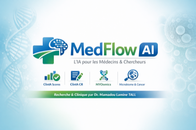
    

  <h2>Dr. Mamadou Lamine TALL</h2>

  

    Founder &amp; CEO · <strong>MedFlow AI</strong> &nbsp;|&nbsp; PhD Bioinformatics · Aix-Marseille 2020 &nbsp;|&nbsp; France
  

  

    
    &nbsp;
    
    &nbsp;
    
  

  

    
    
    
    
  

---

## MedFlow AI — Clinical AI SaaS

> **15 outils IA** pour médecins, chercheurs, biologistes et pharmaciens.  
> Aucune installation. Toujours en français. Propulsé par Claude AI.  
> **→ [medflow-ai.fr](https://medflow-ai.fr)**

---

### ⚡ Outils Premium

<table>
  <thead>
    <tr>
      <th width="52"></th>
      <th>Outil</th>
      <th>Description</th>
    </tr>
  </thead>
  <tbody>
    <tr>
      <td>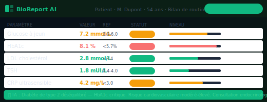</td>
      <td><a href="https://github.com/mamadoulaminetall/BioReport-AI"><strong>BioReport AI</strong></a></td>
      <td>Interprétation de bilan biologique — PDF/image/texte → rapport structuré en 10s</td>
    </tr>
    <tr>
      <td>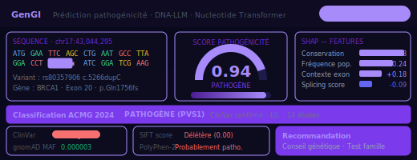</td>
      <td><a href="https://github.com/mamadoulaminetall/GenGI"><strong>GenGI</strong></a></td>
      <td>Génomique intégrative — analyse d'expression, scRNA-seq, visualisation</td>
    </tr>
    <tr>
      <td>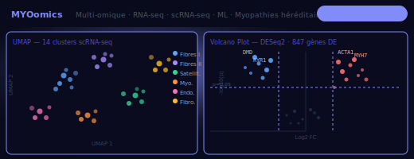</td>
      <td><a href="https://github.com/mamadoulaminetall/myoomics"><strong>MYOomics</strong></a></td>
      <td>Multi-omique des myopathies — RNA-seq, scRNA-seq, ML + méta-analyse</td>
    </tr>
    <tr>
      <td>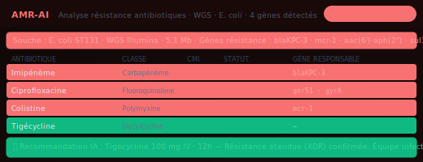</td>
      <td><a href="https://github.com/mamadoulaminetall/amr-ai"><strong>AMR-AI</strong></a></td>
      <td>Résistance antimicrobienne par IA — profils AMR et recommandations thérapeutiques</td>
    </tr>
    <tr>
      <td>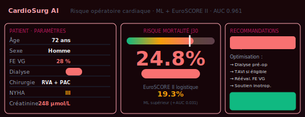</td>
      <td><a href="https://github.com/mamadoulaminetall/cardiosurg-ai"><strong>CardioSurg AI</strong></a></td>
      <td>Aide à la décision en chirurgie cardiaque — scores de risque opératoire</td>
    </tr>
    <tr>
      <td>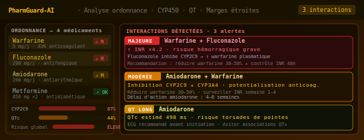</td>
      <td><a href="https://github.com/mamadoulaminetall/pharmguard-ia"><strong>PharmGuard AI</strong></a></td>
      <td>Pharmacovigilance — interactions médicamenteuses, CYP3A4, sécurité thérapeutique</td>
    </tr>
    <tr>
      <td>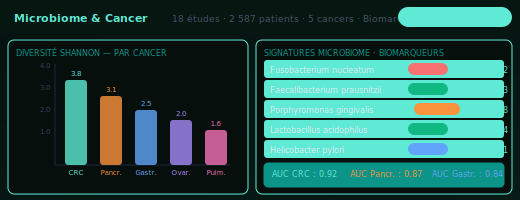</td>
      <td><a href="https://github.com/mamadoulaminetall/microbiome_diagnostic_cancer_precoce"><strong>Microbiome Cancer</strong></a></td>
      <td>Diagnostic précoce du cancer via microbiome — 18 études, 2 587 patients · bioRxiv</td>
    </tr>
    <tr>
      <td>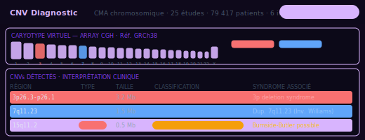</td>
      <td><a href="https://github.com/mamadoulaminetall/cnv-diagnostic-ai"><strong>CNV Diagnostic AI</strong></a></td>
      <td>Détection de CNV — CMA, WGS, NGS · 25 études, 79 417 patients · medRxiv</td>
    </tr>
    <tr>
      <td>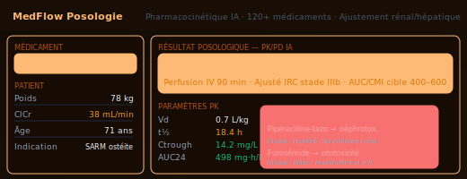</td>
      <td><a href="https://github.com/mamadoulaminetall/medflow-posologie"><strong>MedFlow Posologie</strong></a></td>
      <td>Calcul de posologie adaptatif et interactions médicamenteuses par IA</td>
    </tr>
  </tbody>
</table>

---

### 🆓 Outils Freemium — 3 Mois Offerts

<table>
  <thead>
    <tr>
      <th width="52"></th>
      <th>Outil</th>
      <th>Description</th>
    </tr>
  </thead>
  <tbody>
    <tr>
      <td>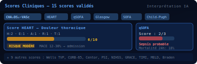</td>
      <td><a href="https://github.com/mamadoulaminetall/medflow-clinical-scores"><strong>Scores Cliniques</strong></a></td>
      <td>Scores validés — Wells, CHA₂DS₂-VASc, SOFA, Glasgow, HEART…</td>
    </tr>
    <tr>
      <td>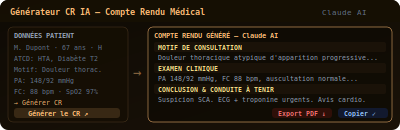</td>
      <td><a href="https://github.com/mamadoulaminetall/medflow-clinical-report"><strong>Générateur CR IA</strong></a></td>
      <td>Compte rendu clinique structuré par IA en quelques secondes</td>
    </tr>
    <tr>
      <td>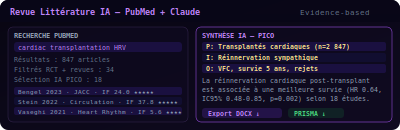</td>
      <td><a href="https://github.com/mamadoulaminetall/medflow-literature-review"><strong>Revue Littérature IA</strong></a></td>
      <td>Génération automatique de revues de littérature médicale par IA</td>
    </tr>
    <tr>
      <td>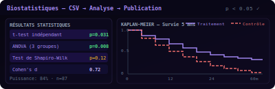</td>
      <td><a href="https://github.com/mamadoulaminetall/medflow-biostatistics"><strong>Biostatistiques</strong></a></td>
      <td>Tests statistiques, analyses et visualisations pour cliniciens et chercheurs</td>
    </tr>
    <tr>
      <td>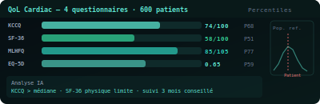</td>
      <td><a href="https://github.com/mamadoulaminetall/cardiac-qol-ai"><strong>Cardiac QoL AI</strong></a></td>
      <td>Qualité de vie cardiaque — LVAD, greffe · méta-analyse + outil IA</td>
    </tr>
    <tr>
      <td>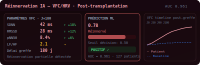</td>
      <td><a href="https://github.com/mamadoulaminetall/medflow-reinnervation-ai"><strong>Réinnervation IA</strong></a></td>
      <td>Prédiction de réinnervation post-transplantation cardiaque — VFC + ML · medRxiv</td>
    </tr>
  </tbody>
</table>

---

## Recherche & Publications

| 31+ | 248+ | 5 800+ | 15 |
|:---:|:---:|:---:|:---:|
| **Publications** | **Citations** | **Échantillons analysés** | **Outils IA** |

**Domaines :** Multi-omique · scRNA-seq · Génomique · IA Clinique · Méta-analyse · AMR · Microbiome · CNV · WGS · Bioinformatique

### Preprints récents

| | Titre | Statut |
|---|---|---|
| 🫀 | Cardiac reinnervation post-transplantation — HRV + predictive AI | `medRxiv MEDRXIV/2026/350174` |
| 🦠 | Microbiome & early cancer detection — 18 études, 2 587 patients | `bioRxiv BIORXIV/2026/719461` |
| 🧬 | CNV diagnostic yield — CMA/WGS, 25 études, 79 417 patients | `medRxiv — in submission` |

---

  
    
  contact@medflow-ai.fr · France · <a href="https://medflow-ai.fr">medflow-ai.fr</a>

