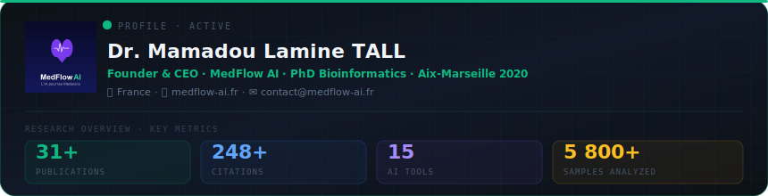

 

&nbsp;&nbsp;

 

 

<table>
<tr>
<td width="52"></td>
<td><a href="https://github.com/mamadoulaminetall/BioReport-AI"><b>BioReport AI</b></a></td>
<td>Interprétation de bilan biologique — PDF/image/texte → rapport structuré en 10s</td>
</tr>
<tr>
<td></td>
<td><a href="https://github.com/mamadoulaminetall/GenGI"><b>GenGI</b></a></td>
<td>Génomique intégrative — RNA-seq, scRNA-seq, analyse d'expression</td>
</tr>
<tr>
<td></td>
<td><a href="https://github.com/mamadoulaminetall/myoomics"><b>MYOomics</b></a></td>
<td>Multi-omique des myopathies — RNA-seq, scRNA-seq, ML + méta-analyse</td>
</tr>
<tr>
<td></td>
<td><a href="https://github.com/mamadoulaminetall/amr-ai"><b>AMR-AI</b></a></td>
<td>Résistance antimicrobienne par IA — profils AMR et recommandations thérapeutiques</td>
</tr>
<tr>
<td></td>
<td><a href="https://github.com/mamadoulaminetall/cardiosurg-ai"><b>CardioSurg AI</b></a></td>
<td>Aide à la décision en chirurgie cardiaque — scores de risque opératoire</td>
</tr>
<tr>
<td></td>
<td><a href="https://github.com/mamadoulaminetall/pharmguard-ia"><b>PharmGuard AI</b></a></td>
<td>Pharmacovigilance — interactions médicamenteuses, CYP3A4, sécurité thérapeutique</td>
</tr>
<tr>
<td></td>
<td><a href="https://github.com/mamadoulaminetall/microbiome_diagnostic_cancer_precoce"><b>Microbiome Cancer</b></a></td>
<td>Diagnostic précoce du cancer via microbiome — 18 études, 2 587 patients · bioRxiv</td>
</tr>
<tr>
<td></td>
<td><a href="https://github.com/mamadoulaminetall/cnv-diagnostic-ai"><b>CNV Diagnostic AI</b></a></td>
<td>Détection de CNV — CMA, WGS, NGS · 25 études, 79 417 patients · medRxiv</td>
</tr>
<tr>
<td></td>
<td><a href="https://github.com/mamadoulaminetall/medflow-posologie"><b>MedFlow Posologie</b></a></td>
<td>Calcul de posologie adaptatif et interactions médicamenteuses par IA</td>
</tr>
</table>

 

 

<table>
<tr>
<td width="52"></td>
<td><a href="https://github.com/mamadoulaminetall/medflow-clinical-scores"><b>Scores Cliniques</b></a></td>
<td>Scores validés — Wells, CHA₂DS₂-VASc, SOFA, Glasgow, HEART…</td>
</tr>
<tr>
<td></td>
<td><a href="https://github.com/mamadoulaminetall/medflow-clinical-report"><b>Générateur CR IA</b></a></td>
<td>Compte rendu clinique structuré par IA en quelques secondes</td>
</tr>
<tr>
<td></td>
<td><a href="https://github.com/mamadoulaminetall/medflow-literature-review"><b>Revue Littérature IA</b></a></td>
<td>Génération automatique de revues de littérature médicale par IA</td>
</tr>
<tr>
<td></td>
<td><a href="https://github.com/mamadoulaminetall/medflow-biostatistics"><b>Biostatistiques</b></a></td>
<td>Tests statistiques, analyses et visualisations pour cliniciens et chercheurs</td>
</tr>
<tr>
<td></td>
<td><a href="https://github.com/mamadoulaminetall/cardiac-qol-ai"><b>Cardiac QoL AI</b></a></td>
<td>Qualité de vie cardiaque — LVAD, greffe · méta-analyse + outil IA</td>
</tr>
<tr>
<td></td>
<td><a href="https://github.com/mamadoulaminetall/medflow-reinnervation-ai"><b>Réinnervation IA</b></a></td>
<td>Prédiction de réinnervation post-transplantation cardiaque — VFC + ML · medRxiv</td>
</tr>
</table>

 

 

| Titre | Journal | Statut |
|---|---|---|
| 🫀 Cardiac reinnervation post-transplantation — HRV + predictive AI | medRxiv | `MEDRXIV/2026/350174` |
| 🦠 Microbiome & early cancer detection — 18 études, 2 587 patients | bioRxiv | `BIORXIV/2026/719461` |
| 🧬 CNV diagnostic yield — CMA/WGS, 25 études, 79 417 patients | medRxiv | `in submission` |

**Domaines :** Multi-omique · scRNA-seq · Génomique · IA Clinique · Méta-analyse · AMR · Microbiome · CNV · WGS

 

contact@medflow-ai.fr · France

